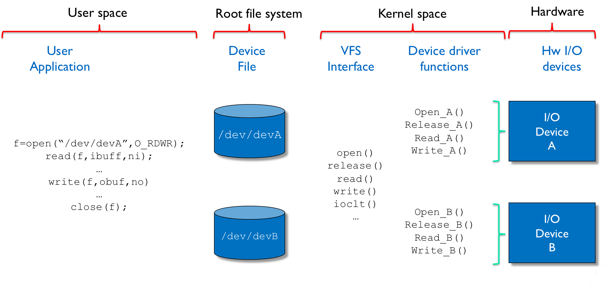
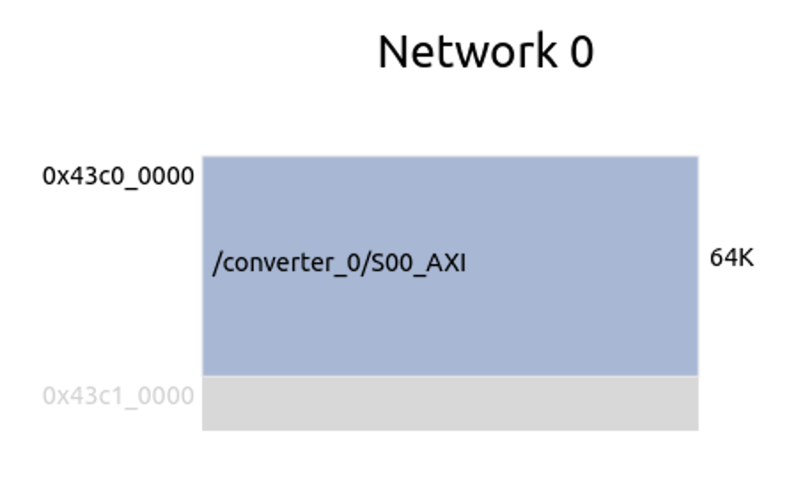

# OSES - Morse Project
- [Morse Driver](#titolo-1) 
	- [Functions](#titolo-2) 
	- [Some lines of code](#titolo-3)
- [Automatic device file creation](#titolo-4) 
	- [Udev in a nutshell](#titolo-5)
- [Authors](#titolo-6)
- [Sources and Credits](#titolo-7)

<a name="titolo-1"></a>
## Morse Driver
Linux provides an abstraction to make communications with I/O devices easy and in order to avoid that software developers must know every detail of physical devices. The portability increases using the same abstraction for different I/O devices. 

One class of devices is called Character Device. A character devices can be accessed as a stream of words as in a file, called Device File, stored in the file system. 

A user application can easily use I/O devices thanks to file abstraction. In particular it can just read and write the file associated with the I/O device through some low-level I/O primitives. 

Linux forwards these operations, such as open, close, read and write, to the I/O device associated with the device file.

The root file system host one device file for each I/O device that the user application needs to use.

Moving from high to low level we are now in kernel space. Here a VFS interface defines the association between the low-level I/O primitives used by the user application and the corresponding device driver functions. It is now the device driver's job to implement the body of these functions. 


<div align="center">
 
</div>

For the Morse driver the main goal is to be able to send strings of characters (ASCII code) and some commands, received from an application. In brief it should behaves as a sort of interface between the Morse Application and a custom hardware programmed on the PYNQ-Z2 FPGA and mapped in memory. 
For this project the custom hardware is a morse converter that converts human language in Morse Code, that is showed and played directly through some peripherals of the board. 
This custom driver is associated with an IP for an AXI4 interface, below the folder named "hardware" is possible to find further information related to the custom hardware.

<div align="center">
 
</div>

This custom hardware has 64 registers on 32 bits mapped in memory starting from the base address `0x34C00000` as shown in the image above.

<a name="titolo-2"></a>
### Functions

```c
static int device_open(struct inode *inode, struct file *file);
```
This function is called when a process opens a device in the Linux driver, handling the device's opening and returning a file descriptor for subsequent use in read and write operations.

```c
static int device_release(struct inode *inode, struct file *file);
```
This function is called when a process closes a device in the Linux driver, performing any necessary cleanup operations associated with the device release.

```c
static ssize_t device_write(struct file *file, const  char__user * buffer, size_t length, loff_t *offset);
```
This function in a Linux driver is responsible for handling write operations to the device, receiving data from the user space via the provided buffer, and writing it to the device. It returns the number of bytes successfully written.

```c
long device_ioctl(struct file *file, unsigned int ioctl_num, unsigned  long ioctl_param);
```
The function in a Linux driver handles input/output control operations initiated by user space programs, allowing them to communicate with the device driver to perform specific tasks.

<a name="titolo-3"></a>
### Some lines of code
```c
mmio = ioremap(BASE_ADDRESS,ADDRESS_SPACE);
```
This line of code indicates the mapping of the device's physical address space to a virtual address space within the Linux operating system. In this case, there's a custom IP with 64 32-bit registers that the ```morse converter``` reads from this mapped memory space.

```c
*(unsigned  int  *)(mmio + i) = (unsigned  int) c; // write i-th value
```
This line of code writes a character ```c``` read from the input buffer directly into a memory location, where the 32-bit registers of the custom IP have been mapped during the initialisation of the device driver.

<a name="titolo-4"></a>
## Automatic device file creation
To enable automatic device file creation during system boot-up, several solutions are possible:

1.  create the device file over udev within your kernel module
2.  write a bash script which will create the device file and it will called on startup of the system

For this project, the second option has been chosen. Under the folder called ```petalinux``` is possible to find further information about the set up to run the bash script during the booting up of the system.

> modprobe morsedriver.ko

First of all using this comman is possible to load the ```morsedriver``` kernel module into the Linux kernel, making its functionality available for use.

 
> mknod /dev/morse_Dev c 244 0

Then the command above creates a device node named ```morse_Dev``` with the specified major and minor numbers. This allows morse applications to interact with the morsedriver module through the device file morse_Dev.

<a name="titolo-5"></a>
### Udev in a nutshell
In Linux, the Udev application dynamically creates and manages device nodes in the virtual filesystem ```/dev``` .

 Udev can be configured to detect Loadable Kernel Module (LKM) loading during boot and create associated device nodes so that they may be used by user programs. Through Udev, users can configure specific rules, such that when the system boots, the required kernel modules are loaded automatically in response to certain events called ```uevents```. This ensures that the kernel modules are loaded and the associated devices are available for use, without requiring any manual intervention on our part.
 Some possible rules may be:

```c
KERNEL=="morsedriver", ACTION=="add", RUN+="/sbin/modprobe morsedriver"
```
Rule for automatically loading the kernel module

```c
KERNEL=="morsedriver", MODE="0666", SYMLINK+="morse_Dev"
```
Rule for creating a device node for the loaded kernel module

<a name="titolo-6"></a>
## Authors
- Samuele Pasquale
- Davide Lezzoche
- Mansour Sohrabian
- Manuel Riso


<a name="titolo-7"></a>
## Sources and Credits
Sources and credits
- [AMD Xilinx PYNQ-Z2](https://www.xilinx.com/support/university/xup-boards/XUPPYNQ-Z2.html)
- [AMD Petalinux guide v2023.2](https://docs.xilinx.com/r/en-US/ug1144-petalinux-tools-reference-guide/Introduction)
- [AMD Xilinx Vivado](https://www.xilinx.com/products/design-tools/vivado.html)
- [Morse Code](https://it.wikipedia.org/wiki/Codice_Morse)
- [PYNQ-Z2 constraints file](https://github.com/Xilinx/PYNQ/blob/master/boards/Pynq-Z2/base/vivado/constraints/base.xdc)
- [PYQN-Z2 schematic file](https://dpoauwgwqsy2x.cloudfront.net/Download/TUL_PYNQ_Schematic_R12.pdf)
- [AMD Xilinx Embedded design](https://xilinx.github.io/Embedded-Design-Tutorials/docs/2022.2/build/html/index.html)
- [Device driver Linux](https://lwn.net/Kernel/LDD3/)
- [Yocto project](https://docs.yoctoproject.org)
