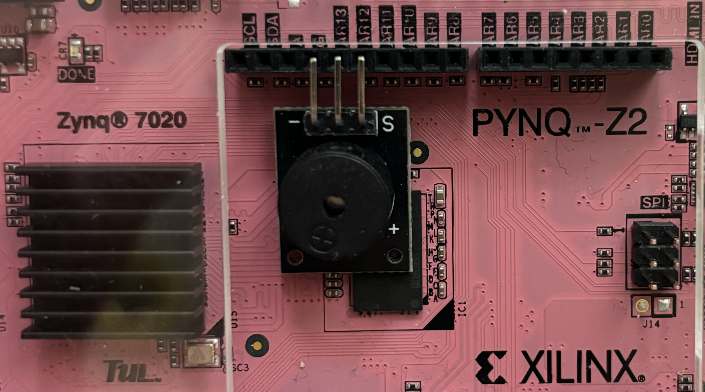

# OSES - Morse Project
- [Hardware description](#titolo-1) 
	- [Converter](#titolo-2) 
	- [Clock Divider](#titolo-3)
	- [Constraints and Pin Assignments](#titolo-4) 
	- [External Devices](#titolo-5)
- [Authors](#titolo-6)
- [Sources and Credits](#titolo-7)

<a name="titolo-1"></a>
## Hardware description
The Programmable Logic (PL) firmware was produced using Xilinx Vivado suite.
Vivado tool facilitates designing HW allowing bolck designing.
Below is shown the block design of the Morse project.

<div align="center">
 
</div>

Converter, ClockDivider and and2 are custom modules, the other insted are Xilinx Intellettual Properties used to interface the Processor System (PS) using the AXI4-Lite protocol.
<a name="titolo-2"></a>
### Converter
The Converter module is designed to receive a stream of characters (representing a sentence) as input. The input is sourced from the Processor System via axi4-lite communication, with one character transmitted at a time. These characters are stored in a First-In-First-Out (FIFO) buffer with a capacity of 63 elements.

Upon reaching the end of the character stream or the end of the FIFO, the Converter initiates the Morse code conversion process. The output of this process consists of Morse code values presented as a square wave. This wave exhibits prolonged high periods to signify dashes and brief high periods for dots. Once the conversion for the last character is complete, the module is ready to accept another character stream as input, enabling a seamless transition to subsequent conversions.
  
  <a name="titolo-3"></a>
### Clock Divider
The following block is a clock divider that transforms a input clock signal into a new clock signal with a different frequency.
Within the ClockDivider module is possible to configure the “DIVISOR” variable which is used as parameter in the code.
To find the value of the Divisor variable the following formula can be used.

```math
CLK_{OUT}[Hz] = \frac{CLK_{IN}[Hz]}{DIVISOR}
```

```math
=> DIVISOR = \frac{CLK_{IN}[Hz]}{CLK_{OUT}[Hz]}
```

For the design of this project the input clock signal that feeds the Clock Divider is the PL input clock. Since the working frequency for the external speaker audio is `1.5 KHz ~ 2.5 KHz` and the PL clock signal is `125 MHz` the DIVISOR will be
```
DIVISOR = 0x000F424
```
It is possible to find more information about the speaker within the following document.

<a name="titolo-4"></a>
### Constraints and Pin Assignments
In order to define the pin assignment the constraints file have been settled as below.
``` python
# Led
set_property -dict {PACKAGE_PIN R14 IOSTANDARD LVCMOS33} [get_ports {GPO}]
```

The pin assignment for the Led allows to show the morse conversion through the led LD0 of the pynq-Z2 board

``` python
# Speaker
set_property -dict {PACKAGE_PIN R16 IOSTANDARD LVCMOS33} [get_ports { CLK_OUT }]
```
The pin assignment for the speaker allows to play the morse conversion from the speaker connected to Arduino Pins of the pynq-Z2 board.

``` python
# Clock signal 125 MHz
set_property -dict { PACKAGE_PIN H16 IOSTANDARD LVCMOS33 } [get_ports { CLK_IN }];
create_clock -add -name sys_clk_pin -period 8.00 -waveform {0  5} [get_ports { CLK_IN }];
```
The pin assignment shown above allows to connect the external port CLK_IN of the clock divisor with the pin H16 of the PL and define a clock frequency of 125 MHz.

<a name="titolo-5"></a>
### External Devices
1. **Audio**
It is possible to play the morse conversion through a speaker compatible with the Arduino digital pins. In particular, the GND must be connected to the GND pin while the speaker signal pin must be connected to the AR12 pin on the PYNQ-Z2 board.
For the project a Passive Piezo Buzzer Speaker has been used. Further information can be found in the credits at the bottom of the document. 

<div align="center">
 
</div>

2. **Led**
The PYNQ-Z2 has 4 LEDs. The morse code conversion is shown by the rightmost led (LD0).
<div align="center">
 
</div>

<a name="titolo-6"></a>
## Authors
- Samuele Pasquale
- Davide Lezzoche
- Mansour Sohrabian
- Manuel Riso

<a name="titolo-7"></a>
## Sources and Credits
Sources and credits
- [AMD Xilinx PYNQ-Z2](https://www.xilinx.com/support/university/xup-boards/XUPPYNQ-Z2.html)
- [AMD Petalinux guide v2023.2](https://docs.xilinx.com/r/en-US/ug1144-petalinux-tools-reference-guide/Introduction)
- [AMD Xilinx Vivado](https://www.xilinx.com/products/design-tools/vivado.html)
- [Morse Code](https://it.wikipedia.org/wiki/Codice_Morse)
- [PYNQ-Z2 constraints file](https://github.com/Xilinx/PYNQ/blob/master/boards/Pynq-Z2/base/vivado/constraints/base.xdc)
- [PYQN-Z2 schematic file](https://dpoauwgwqsy2x.cloudfront.net/Download/TUL_PYNQ_Schematic_R12.pdf)
- [AMD Xilinx Embedded design](https://xilinx.github.io/Embedded-Design-Tutorials/docs/2022.2/build/html/index.html)
- [Device driver Linux](https://lwn.net/Kernel/LDD3/)
- [Yocto project](https://docs.yoctoproject.org)
