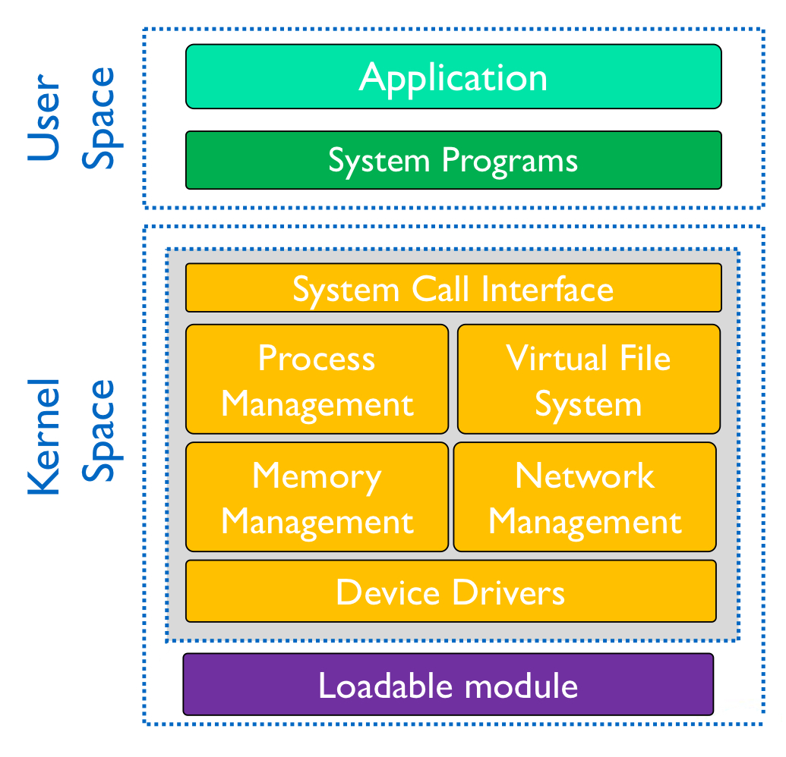
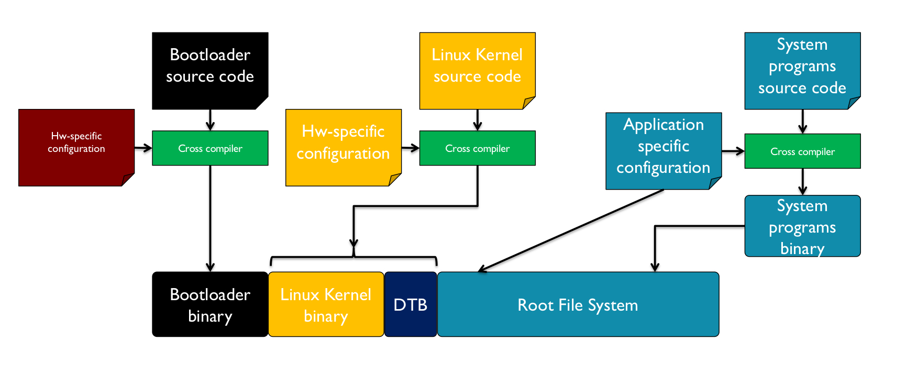
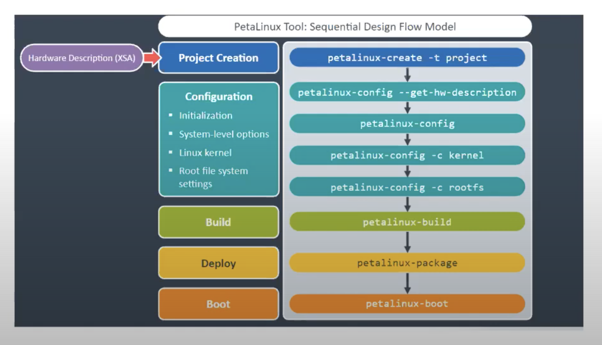
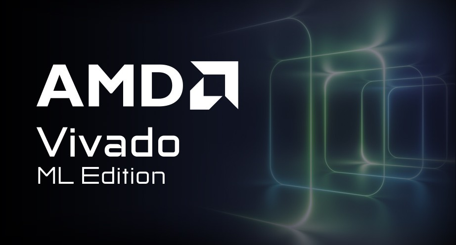
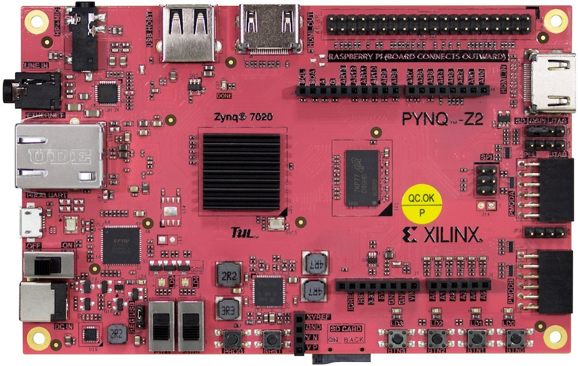

# OSES - Morse Project
- [Linux for Embedded Systems](#titolo-1) 
- [The Project](#titolo-2) 
- [The Morse Code](#titolo-3)
- [Workflow](#titolo-4) 
- [Petalinux](#titolo-5) 
- [Vivado](#titolo-6)
- [Pynq-Z2](#titolo-7)
- [Authors](#titolo-8)
- [Sources and Credits](#titolo-9)

<a name="titolo-1"></a>
## Linux for Embedded Systems
The following project is intended to implement a Linux-based embedded system on the PYNQ-Z2 board. Linux is open source license and it is maintained and improved by a large community regularly. This operating system has a very large ecosystem, therefore it is used only in some scenarios with boards that are powerful enough. On the other hand it is flexible and adaptable to different hardware SoC, such as ARM, AMD, and RISC-V.
The main challenge for Linux used in embedded systems is that it is big, in terms of size and bytes. Thus sometimes  useless parts of the operating system may be removed, while others customised for a specific hardware and purpose. 
Linux has a Layered Architecture based on Monolithic Kernel. In this architecture the operating system is divided into different layers. Each of these use functions and services provided by only lower layers. Moreover each layer uses a dedicated virtual address space mapped into a physical memory. 
The reason why the architecture is called Monolithic Kernel is because all services are delivered by a single executable, thus the entire operating system works in kernel space. 
In addition services can be extended at run-time through Loadable Kernel Modules (LKM). Using LKM we are able to build separate modules for device drivers, compiling and uploading them dynamically on the board.

<div align="center">
  
</div>

<a name="titolo-2"></a>
## The Project
The project intents is to work directly on some levels of the Linux Layered architecture and not only. In particular, the focus of the project is on:
- Develop custom hardware
- Build a device driver for the custom hardware
- Implement a software application

For the project, it has been chosen to implement a human-Morse translator, allowing for the translation of phrases from human language to Morse code.
The translation is entirely processed in hardware, while interfacing with the translator is made possible through a device driver. Subsequently, users are able to send words, phrases, and commands via an application.
Within the project folder, it is possible to find a subfolder structure with brief descriptions of the contents and the main project files.
```bash
├── Application
│   ├── morseapplication.c
│   ├── README.md
├── Driver
│   ├── morsedriver.c
│   ├── morsedriver.h
│   ├── bootscript.sh
│   ├── README.md
├── Hardware
│   ├── ClockDivider.v
│   ├── and2.v
│   ├── converter_v1_0.vhd
│   ├── converter_v1_0_S00_AXI.vhd
│   ├── Constraints.xdc
│   ├── specification_speaker.pdf
│   ├── README.md
├── Images
│   ├── /...
├── PetaLinux
│   ├── README.md
├── SD
│   ├── BOOT
│   │   ├── BOOT.BIN
│   │   ├── boot.scr
│   │   ├── image.ub
│   ├── RootFS
│   │   ├── rootfs.tar.gz
└── README.md
```
<a name="titolo-3"></a>
## The Morse Code
The Morse code is an encoding system that represents letters and numbers through a sequence of dots and dashes. These dots and dashes are transmitted as sound or light signals, each with a specific duration. Specifically, a "dot" is represented by a short sound or light signal, while a "dash" is represented by a longer sound or light signal. The symbols are organized into sequences of dots and dashes, with pauses between characters and words. 

<div align="center">
  
</div>


<a name="titolo-4"></a>
## Workflow
An Embedded Linux system requires the following components to operate:
1. Bootloader
2. Linux Kernel
3. Device Tree Blob
4. Root File System

These components shall be configured for the embedded system hardware platform, compiled and linked into an executable and finally deployed into the embedded system persisted storage for booting. 

<div align="center">
  
</div>

The image above shows the entire process to build an embedded Linux system. As it can be noticed it is a complex operation, thus some automatic tools, known as build systems, are available. 

<a name="titolo-5"></a>
## Petalinux

For this project, Yocto has been selected as build system. Yocto is an open-source build system widely used in the industry. 
The choice is related to the fact that AMD provides a development tool called PetaLinux, which contains everything necessary to build, develop, test, and deploy embedded Linux systems. 

PetaLinux is an embedded Linux Software Development Kit (SDK) targeting FPGA-based system-on-a-chip (SoC) designs or FPGA designs and contains:
-   Yocto Extensible  SDK
-   Software Command-Line Tool and toolchains
-   PetaLinux Command Line Interface (CLI) tools

More specifically, the CLI commands are:
-	`petalinux-create`
-   `petalinux-config`
-   `petalinux-build`
-   `petalinux-util`
-   `petalinux-package`
-   `petalinux-upgrade`
-   `petalinux-devtool`
-   `petalinux-boot`


<div align="center">
  
</div>

<a name="titolo-6"></a>
## Vivado
Vivado is the AMD software suite for HDL and system-level design. Vivado includes a HDL simulator, IP Integrator for system-level integration, and tools for synthesis, implementation, bitstream generation and programming of AMD platforms.

<div align="center">
  
</div>

<a name="titolo-7"></a>
## Pynq-Z2
PYNQ-Z2 board, based on Xilinx Zynq SoC, is an open-source project designed for embedded systems development.
Through some tool and IP, like Vivado and Vitis, designers can exploit the benefits of programmable logic and microprocessors to build more capable and exciting electronic systems.
Further information can be found in the credits at the bottom of the document. 


<div align="center">
  
</div>

<a name="titolo-8"></a>
## Authors
- Samuele Pasquale
- Davide Lezzoche
- Mansour Sohrabian
- Manuel Riso

<a name="titolo-9"></a>
## Sources and Credits
Sources and credits
- [AMD Xilinx PYNQ-Z2](https://www.xilinx.com/support/university/xup-boards/XUPPYNQ-Z2.html)
- [AMD Petalinux guide v2023.2](https://docs.xilinx.com/r/en-US/ug1144-petalinux-tools-reference-guide/Introduction)
- [AMD Xilinx Vivado](https://www.xilinx.com/products/design-tools/vivado.html)
- [Morse Code](https://it.wikipedia.org/wiki/Codice_Morse)
- [PYNQ-Z2 constraints file](https://github.com/Xilinx/PYNQ/blob/master/boards/Pynq-Z2/base/vivado/constraints/base.xdc)
- [PYQN-Z2 schematic file](https://dpoauwgwqsy2x.cloudfront.net/Download/TUL_PYNQ_Schematic_R12.pdf)
- [AMD Xilinx Embedded design](https://xilinx.github.io/Embedded-Design-Tutorials/docs/2022.2/build/html/index.html)
- [Device driver Linux](https://lwn.net/Kernel/LDD3/)
- [Yocto project](https://docs.yoctoproject.org)
